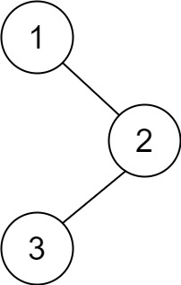
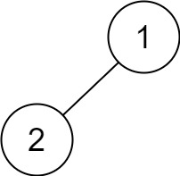

Given the root of a binary tree, return the postorder traversal of its nodes' values.

 

Example 1:

```
Input: root = [1,null,2,3]
Output: [3,2,1]
```
Example 2:
```
Input: root = []
Output: []
```
Example 3:
```
Input: root = [1]
Output: [1]
```
Example 4:

```
Input: root = [1,2]
Output: [2,1]
```
Example 5:

```
Input: root = [1,null,2]
Output: [2,1]
```

Constraints:

- The number of the nodes in the tree is in the range [0, 100].
- -100 <= Node.val <= 100